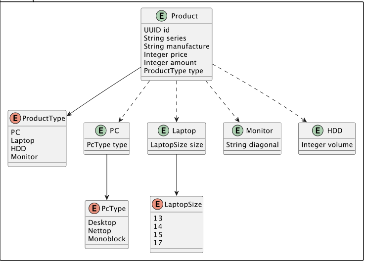

#### Магазин, торгующий компьютерами и комплектующими

Необходимо реализовать RESTful backend приложение, выполняющее:

- Добавление товара
- Редактирование товара
- Просмотр существующих товаров по типу
- Получение товара по идентификатору

Модель приложения:

-------------------------------------------------------------

- Stack: [JDK 17](http://jdk.java.net/17/), Spring Boot 3.x, Lombok, SpringDoc OpenApi 2.x, Mapstruct, H2
- Run: `mvn spring-boot:run` in root directory.

-----------------------------------------------------
[REST API documentation](http://localhost:8080/)  
